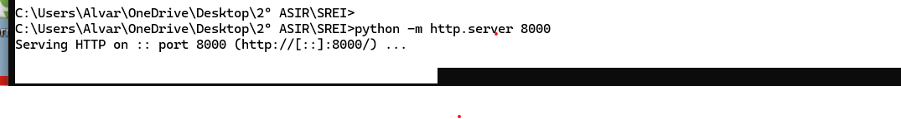
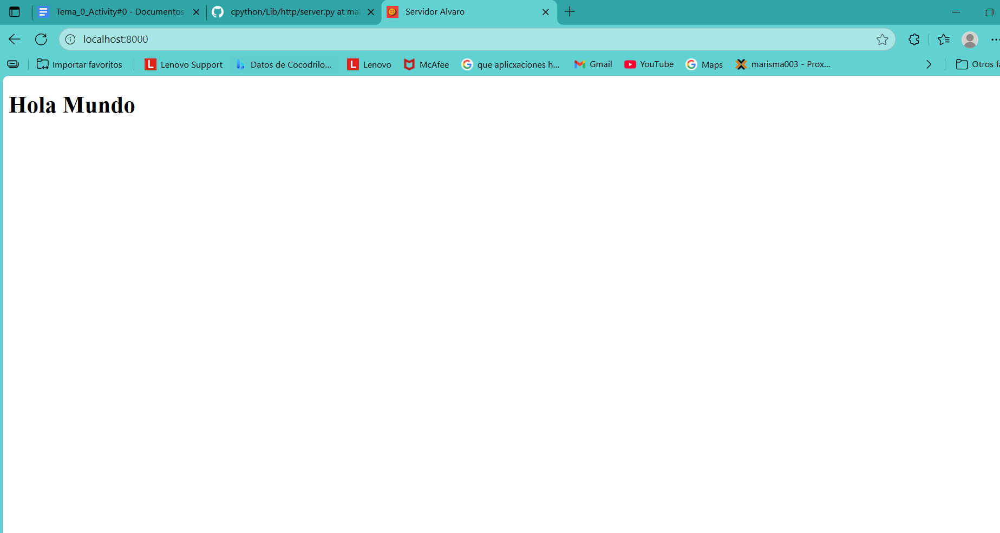
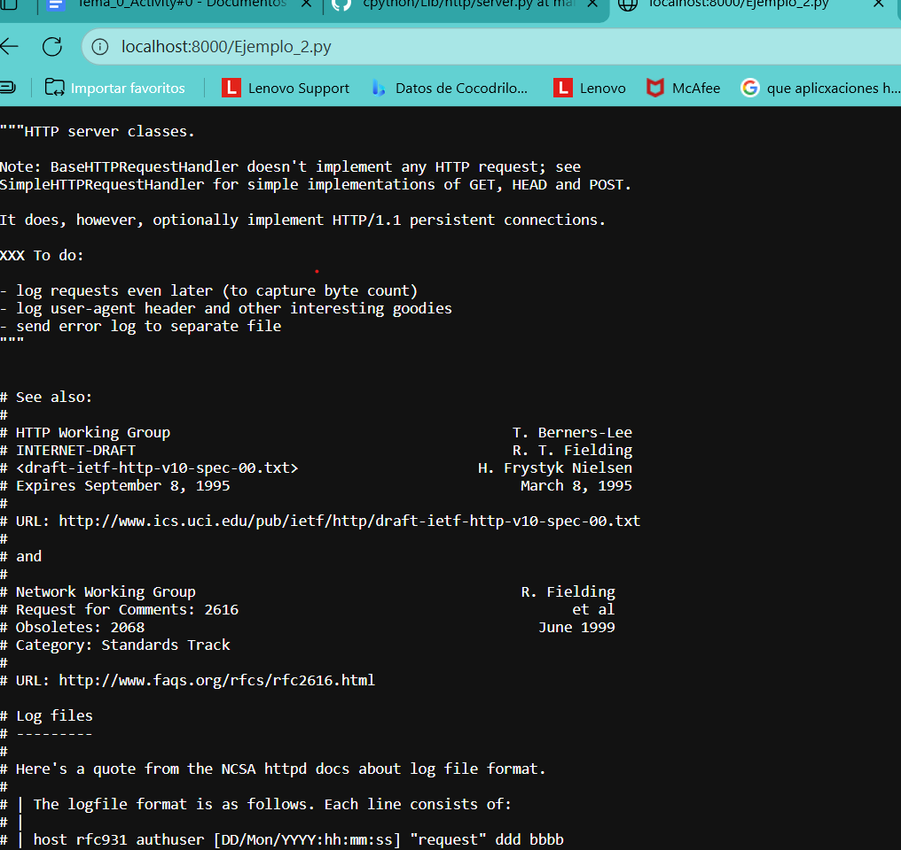
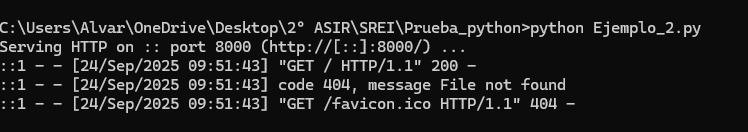
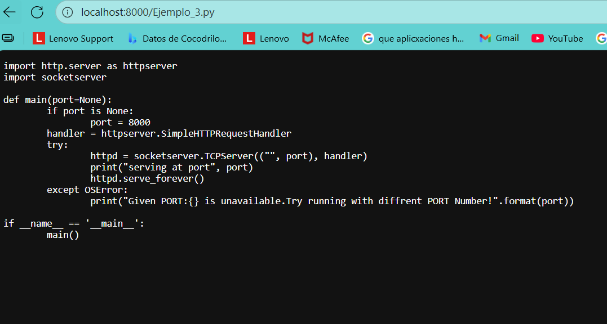
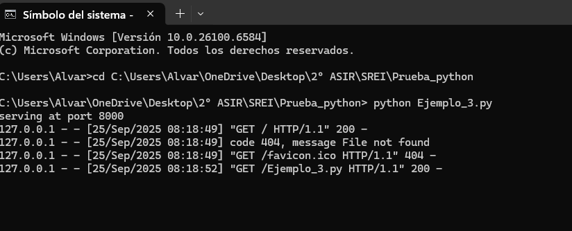

## Actividad 5
- Aqui veremos unos pequeños ejemplo de servidores web
## Ejemplo 1 - Servidor simple
- Aqui vemos el servidor corriendo en consola

- Aqui vemos la página en el navegador

## Ejemplo 2 - http server
- Aqui vemos el servidor corriendo en consola

- Aqui vemos la página en el navegador

## Ejemplo 3 - dummy web server
- Aqui vemos el servidor corriendo en consola

- Aqui vemos la página en el navegador

